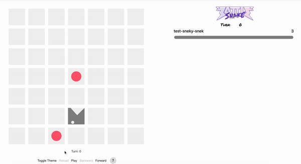
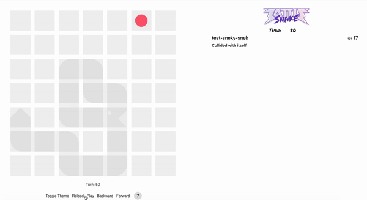
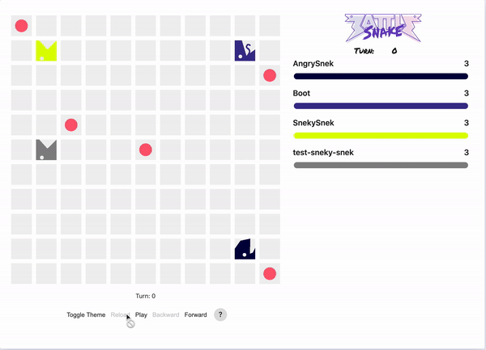

# A Personal Battlesnake Written in Python

Forked from the official Battlesnake repository [starter-snake-python](https://github.com/BattlesnakeOfficial/starter-snake-python)

### TODO
- <del>Use BFS to find food

## Finding Food And Next Steps

Snake finds food but dies by moving out of bounds. 

 

Snake finds food but dies by trapping itself.

### TODO
- Avoid moving out of bounds
- Avoid/reduce chances of trapping itself.

## Playing Against Other Snakes And Challenges

### Challenges
- Snake sometimes moves out of bounds or runs into another snake. This is because battlesnake engine provides a 500ms limit to make a move, otherwise the snake will continue moving in the direct it is already facing. For our snake's situation, we may have gone over the limit because the path to the food is very difficult and takes a long time to compute.

Solutions:

1. Don't use python
2. Limit the breath first search to a certain level of depth to search so that it doesn't spend to much time looking for a path to the food if the food is challenging to get to.
